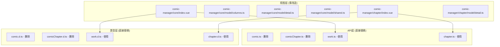
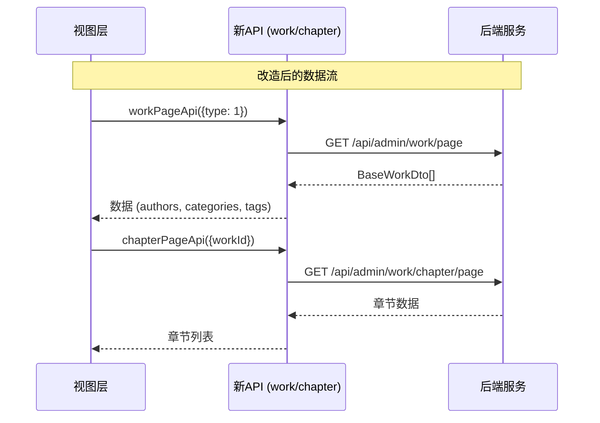
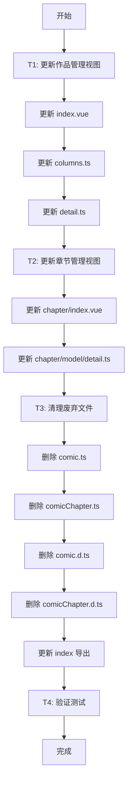

# Comic 接口迁移至 Work 模块 - 架构设计文档

## 1. 整体架构

### 1.1 改造范围图

### 1.2 数据流向

## 2. 详细变更清单

### 2.1 作品管理视图变更

#### 文件: `comic-manager/core/index.vue`

| 行号 | 变更类型 | 原代码 | 新代码 |
|-----|---------|-------|-------|
| 5-9 | 导入类型 | `BaseComicDto, ComicCreateRequest, ComicUpdateRequest` | `BaseWorkDto, WorkCreateRequest, WorkUpdateRequest` |
| 17-23 | 导入API | `comicCreateApi, comicDeleteApi, comicDetailApi, comicPageApi, comicUpdateApi` | `workCreateApi, workDeleteApi, workDetailApi, workPageApi, workUpdateApi` |
| 37 | 类型定义 | `VxeGridProps<BaseComicDto>` | `VxeGridProps<BaseWorkDto>` |
| 42 | API调用 | `comicPageApi(...)` | `workPageApi(...)` |
| 71 | 函数参数 | `row?: BaseComicDto` | `row?: BaseWorkDto` |
| 74 | API调用 | `comicDetailApi(...)` | `workDetailApi(...)` |
| 75 | 字段访问 | `record?.comicAuthors` | `record?.authors` |
| 76-78 | 字段访问 | `record?.comicCategories` | `record?.categories` |
| 79 | 字段访问 | `record?.comicTags` | `record?.tags` |
| 144 | 函数参数 | `ComicCreateRequest \| ComicUpdateRequest` | `WorkCreateRequest \| WorkUpdateRequest` |
| 145-147 | API调用 | `comicUpdateApi/comicCreateApi` | `workUpdateApi/workCreateApi` |
| 153-154 | 函数参数/API | `BaseComicDto, comicDeleteApi` | `BaseWorkDto, workDeleteApi` |
| 159 | 函数参数 | `BaseComicDto` | `BaseWorkDto` |
| 162 | API调用 | `comicUpdateApi` | `workUpdateApi` |
| 172 | 函数参数 | `BaseComicDto` | `BaseWorkDto` |
| 289 | API引用 | `comicDetailApi` | `workDetailApi` |
| 290 | 类型转换 | `data: BaseComicDto` | `data: BaseWorkDto` |

#### 文件: `comic-manager/core/model/columns.ts`

| 行号 | 变更类型 | 原代码 | 新代码 |
|-----|---------|-------|-------|
| 3 | 导入类型 | `BaseComicDto` | `BaseWorkDto` |
| 16 | 类型参数 | `toTableColumns<BaseComicDto>` | `toTableColumns<BaseWorkDto>` |
| 55-70 | 字段定义 | `comicAuthors` | `authors` |
| 62-66 | 类型引用 | `BaseComicDto['comicAuthors']` | `BaseWorkDto['authors']` |
| 81-96 | 字段定义 | `comicCategories` | `categories` |
| 88-92 | 类型引用 | `BaseComicDto['comicCategories']` | `BaseWorkDto['categories']` |
| 97-111 | 字段定义 | `comicTags` | `tags` |
| 104-107 | 类型引用 | `BaseComicDto['comicTags']` | `BaseWorkDto['tags']` |

#### 文件: `comic-manager/core/model/detail.ts`

| 行号 | 变更类型 | 原代码 | 新代码 |
|-----|---------|-------|-------|
| 3 | 导入类型 | `BaseComicDto` | `BaseWorkDto` |
| 12 | 函数参数 | `detail: BaseComicDto` | `detail: BaseWorkDto` |
| 28-30 | 字段访问 | `detail.comicAuthors` | `detail.authors` |
| 35-38 | 字段访问 | `detail.comicCategories` | `detail.categories` |
| 43 | 字段访问 | `detail.comicTags` | `detail.tags` |

### 2.2 章节管理视图变更

#### 文件: `comic-manager/chapter/index.vue`

| 行号 | 变更类型 | 原代码 | 新代码 |
|-----|---------|-------|-------|
| 3-7 | 导入类型 | `ComicChapterCreateRequest, ComicChapterPageResponseDto, ComicChapterUpdateRequest` | `ChapterCreateRequest, ChapterPageResponse, ChapterUpdateRequest` |
| 12-20 | 导入API | `comicChapterCreateApi, comicChapterDeleteApi, comicChapterDetailApi, comicChapterPageApi, comicChapterSwapSortOrderApi, comicChapterUpdateApi` | `chapterCreateApi, chapterDeleteApi, chapterDetailApi, chapterPageApi, chapterSwapSortOrderApi, chapterUpdateApi` |
| 32 | 类型定义 | `ShareData = { comicId: number; comicName: string }` | `ShareData = { workId: number; workName: string }` |
| 59 | 类型定义 | `VxeGridProps<ComicChapterPageResponseDto>` | `VxeGridProps<ChapterPageResponse>` |
| 64 | 参数名 | `formValues.comicId` | `formValues.workId` |
| 65-71 | API调用 | `comicChapterPageApi` | `chapterPageApi` |
| 81-85 | API调用 | `comicChapterSwapSortOrderApi` | `chapterSwapSortOrderApi` |
| 114 | 函数参数 | `ComicChapterPageResponseDto` | `ChapterPageResponse` |
| 124 | 函数参数 | `ComicChapterPageResponseDto` | `ChapterPageResponse` |
| 127 | 参数名 | `comicId: shareData.value!.comicId` | `workId: shareData.value!.workId` |
| 135 | 函数参数 | `ComicChapterPageResponseDto` | `ChapterPageResponse` |
| 140 | API调用 | `comicChapterDetailApi` | `chapterDetailApi` |
| 146-147 | 函数参数 | `ComicChapterCreateRequest \| ComicChapterUpdateRequest` | `ChapterCreateRequest \| ChapterUpdateRequest` |
| 149 | 参数名 | `values.comicId` | `values.workId` |
| 150 | API调用 | `comicChapterUpdateApi/comicChapterCreateApi` | `chapterUpdateApi/chapterCreateApi` |
| 159 | 函数参数 | `ComicChapterPageResponseDto` | `ChapterPageResponse` |
| 160 | API调用 | `comicChapterDeleteApi` | `chapterDeleteApi` |
| 166 | 函数参数 | `ComicChapterPageResponseDto` | `ChapterPageResponse` |
| 168 | API调用 | `comicChapterUpdateApi` | `chapterUpdateApi` |
| 234 | API引用 | `comicChapterDetailApi` | `chapterDetailApi` |

#### 文件: `comic-manager/chapter/model/detail.ts`

| 行号 | 变更类型 | 原代码 | 新代码 |
|-----|---------|-------|-------|
| 1 | 导入类型 | `ComicChapterDetailDto` | `IdDto` (或保持不变，视实际返回结构) |
| 31 | 字段访问 | `detail.relatedComic?.name` | 保持不变（需确认返回结构） |
| 190 | 字段名 | `detail.comicId` | `detail.workId` |

### 2.3 API 层变更

#### 需要删除的文件

| 文件路径 | 说明 |
|---------|------|
| `api/core/work/comic.ts` | 废弃的漫画 API |
| `api/core/work/comicChapter.ts` | 废弃的章节 API |
| `api/types/work/comic.d.ts` | 废弃的漫画类型定义 |
| `api/types/work/comicChapter.d.ts` | 废弃的章节类型定义 |

#### 需要更新的文件

| 文件路径 | 变更内容 |
|---------|---------|
| `api/core/index.ts` | 移除 comic 和 comicChapter 的导出 |
| `api/types/index.d.ts` | 移除 comic 和 comicChapter 的导出 |

## 3. 执行顺序

## 4. 风险评估

### 4.1 低风险

- ✅ 接口已完全对齐
- ✅ 类型定义完整
- ✅ 字段映射清晰

### 4.2 注意事项

1. **章节详情返回类型**: `ChapterDetailResponse = IdDto`，实际返回数据结构需确认
2. **workType 参数**: 章节创建时需要传递 `workType: 1`（漫画固定值）

## 5. 测试清单

### 5.1 作品管理

| 测试项 | 预期结果 |
|-------|---------|
| 打开漫画管理页面 | 列表正确显示，作者/分类/标签正确渲染 |
| 点击添加漫画 | 表单正确打开 |
| 填写并提交创建表单 | 创建成功，列表刷新 |
| 点击编辑 | 表单正确打开，数据回填正确 |
| 提交编辑表单 | 更新成功，列表刷新 |
| 切换发布状态 | 状态切换成功 |
| 切换推荐/热门/新作状态 | 状态切换成功 |
| 点击删除 | 删除确认后成功删除 |
| 点击章节管理 | 章节管理弹窗正确打开 |
| 点击详情 | 详情弹窗正确显示所有信息 |

### 5.2 章节管理

| 测试项 | 预期结果 |
|-------|---------|
| 打开章节管理弹窗 | 章节列表正确显示 |
| 点击添加章节 | 表单正确打开 |
| 填写并提交创建表单 | 创建成功，列表刷新 |
| 点击编辑 | 表单正确打开，数据回填正确 |
| 提交编辑表单 | 更新成功，列表刷新 |
| 拖拽排序 | 排序成功，顺序更新 |
| 点击删除 | 删除确认后成功删除 |
| 点击内容管理 | 内容管理弹窗正确打开 |
