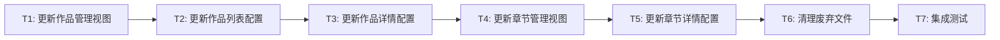

# Comic 接口迁移至 Work 模块 - 原子任务清单

## 任务依赖图



---

## T1: 更新作品管理主视图

### 输入契约
- 新接口定义已完善
- 文件: `views/content-manager/comic-manager/core/index.vue`

### 任务描述
更新作品管理主视图的导入和API调用：

**Step 1: 更新类型导入**
```typescript
// 旧代码 (第5-9行)
import type {
  BaseComicDto,
  ComicCreateRequest,
  ComicUpdateRequest,
} from '#/api/types';

// 新代码
import type {
  BaseWorkDto,
  WorkCreateRequest,
  WorkUpdateRequest,
} from '#/api/types';
```

**Step 2: 更新API导入**
```typescript
// 旧代码 (第17-23行)
import {
  categoryPageApi,
  comicCreateApi,
  comicDeleteApi,
  comicDetailApi,
  comicPageApi,
  comicUpdateApi,
  tagPageApi,
} from '#/api';

// 新代码
import {
  categoryPageApi,
  workCreateApi,
  workDeleteApi,
  workDetailApi,
  workPageApi,
  workUpdateApi,
  tagPageApi,
} from '#/api';
```

**Step 3: 更新类型引用和API调用**
- 第37行: `VxeGridProps<BaseComicDto>` → `VxeGridProps<BaseWorkDto>`
- 第42行: `comicPageApi` → `workPageApi`
- 第71行: `row?: BaseComicDto` → `row?: BaseWorkDto`
- 第74行: `comicDetailApi` → `workDetailApi`

**Step 4: 更新字段访问**
```typescript
// 旧代码 (第75-79行)
record.authorIds = record?.comicAuthors.map((item) => item.author);
record.categoryIds = record?.comicCategories.map(
  (item) => item.category.id,
);
record.tagIds = record?.comicTags.map((item) => item.tag.id);

// 新代码
record.authorIds = record?.authors.map((item) => item.author);
record.categoryIds = record?.categories.map(
  (item) => item.category.id,
);
record.tagIds = record?.tags.map((item) => item.tag.id);
```

**Step 5: 更新其他函数**
- 第144行: 参数类型 `WorkCreateRequest | WorkUpdateRequest`
- 第145-147行: `comicUpdateApi/workCreateApi` → `workUpdateApi/workCreateApi`
- 第153-162行: 更新所有函数参数和API调用
- 第289-290行: 更新详情API引用

### 输出契约
- 所有类型引用更新为 `BaseWorkDto`
- 所有API调用更新为 `workXxxApi`
- 所有字段访问更新为新字段名

### 验收标准
- [ ] 类型导入正确
- [ ] API导入正确
- [ ] 类型引用全部更新
- [ ] API调用全部更新
- [ ] 字段访问全部更新
- [ ] 无 TypeScript 错误

---

## T2: 更新作品列表配置

### 输入契约
- T1 已完成
- 文件: `views/content-manager/comic-manager/core/model/columns.ts`

### 任务描述
更新作品列表列配置中的类型和字段：

**Step 1: 更新类型导入**
```typescript
// 旧代码 (第3行)
import type { BaseComicDto } from '#/api/types';

// 新代码
import type { BaseWorkDto } from '#/api/types';
```

**Step 2: 更新字段名**
```typescript
// 旧代码 (第55-70行)
comicAuthors: {
  title: '作者',
  width: 240,
  sort: 2,
  cellRender: {
    name: 'CellTag',
    props: {
      formatter: (row: BaseComicDto['comicAuthors']) => {
        return row?.map(
          (author: BaseComicDto['comicAuthors'][number]) =>
            author.author.name,
        );
      },
    },
  },
},

// 新代码
authors: {
  title: '作者',
  width: 240,
  sort: 2,
  cellRender: {
    name: 'CellTag',
    props: {
      formatter: (row: BaseWorkDto['authors']) => {
        return row?.map(
          (author: BaseWorkDto['authors'][number]) =>
            author.author.name,
        );
      },
    },
  },
},
```

**Step 3: 同样更新 comicCategories 和 comicTags**
- `comicCategories` → `categories`
- `comicTags` → `tags`
- 类型引用全部改为 `BaseWorkDto`

### 输出契约
- 列配置中的字段名全部更新
- 类型引用全部更新

### 验收标准
- [ ] 类型导入更新
- [ ] comicAuthors → authors
- [ ] comicCategories → categories
- [ ] comicTags → tags
- [ ] 无 TypeScript 错误

---

## T3: 更新作品详情配置

### 输入契约
- T2 已完成
- 文件: `views/content-manager/comic-manager/core/model/detail.ts`

### 任务描述
更新作品详情展示配置：

**Step 1: 更新类型导入**
```typescript
// 旧代码 (第3行)
import type { BaseComicDto } from '#/api/types';

// 新代码
import type { BaseWorkDto } from '#/api/types';
```

**Step 2: 更新函数参数和字段访问**
```typescript
// 旧代码
export function getDetailCards(
  detail: BaseComicDto,
  dataDict: Recordable<undefined | UseDictItem>,
) {
  // ...
  detail.comicAuthors?.map(...)
  detail.comicCategories?.map(...)
  detail.comicTags?.map(...)
}

// 新代码
export function getDetailCards(
  detail: BaseWorkDto,
  dataDict: Recordable<undefined | UseDictItem>,
) {
  // ...
  detail.authors?.map(...)
  detail.categories?.map(...)
  detail.tags?.map(...)
}
```

### 输出契约
- 详情配置中的类型和字段全部更新

### 验收标准
- [ ] 类型导入更新
- [ ] 函数参数类型更新
- [ ] comicAuthors → authors
- [ ] comicCategories → categories
- [ ] comicTags → tags
- [ ] 无 TypeScript 错误

---

## T4: 更新章节管理视图

### 输入契约
- T3 已完成
- 文件: `views/content-manager/comic-manager/chapter/index.vue`

### 任务描述
更新章节管理视图的导入、类型和参数：

**Step 1: 更新类型导入**
```typescript
// 旧代码 (第3-7行)
import type {
  ComicChapterCreateRequest,
  ComicChapterPageResponseDto,
  ComicChapterUpdateRequest,
} from '#/api/types';

// 新代码
import type {
  ChapterCreateRequest,
  ChapterPageResponse,
  ChapterUpdateRequest,
} from '#/api/types';
```

**Step 2: 更新API导入**
```typescript
// 旧代码 (第12-20行)
import {
  comicChapterCreateApi,
  comicChapterDeleteApi,
  comicChapterDetailApi,
  comicChapterPageApi,
  comicChapterSwapSortOrderApi,
  comicChapterUpdateApi,
  levelRulesPageApi,
} from '#/api';

// 新代码
import {
  chapterCreateApi,
  chapterDeleteApi,
  chapterDetailApi,
  chapterPageApi,
  chapterSwapSortOrderApi,
  chapterUpdateApi,
  levelRulesPageApi,
} from '#/api';
```

**Step 3: 更新 ShareData 类型**
```typescript
// 旧代码 (第32行)
type ShareData = { comicId: number; comicName: string };

// 新代码
type ShareData = { workId: number; workName: string };
```

**Step 4: 更新所有 API 调用和参数**
- 第59行: `ComicChapterPageResponseDto` → `ChapterPageResponse`
- 第64行: `formValues.comicId` → `formValues.workId`
- 第65-71行: `comicChapterPageApi` → `chapterPageApi`
- 第81-85行: `comicChapterSwapSortOrderApi` → `chapterSwapSortOrderApi`
- 第114-176行: 更新所有函数参数类型和API调用
- 第127行: `comicId` → `workId`
- 第149行: 添加 `values.workType = 1;`（漫画固定值）
- 第234行: `comicChapterDetailApi` → `chapterDetailApi`

**Step 5: 更新 modal title 设置**
```typescript
// 旧代码 (第53行)
title: shareData.value.comicName,

// 新代码
title: shareData.value.workName,
```

### 输出契约
- 所有类型、API、参数全部更新

### 验收标准
- [ ] 类型导入更新
- [ ] API导入更新
- [ ] ShareData 类型更新
- [ ] 所有 API 调用更新
- [ ] comicId → workId
- [ ] 添加 workType 参数
- [ ] 无 TypeScript 错误

---

## T5: 更新章节详情配置

### 输入契约
- T4 已完成
- 文件: `views/content-manager/comic-manager/chapter/model/detail.ts`

### 任务描述
更新章节详情配置：

**Step 1: 更新类型导入**
```typescript
// 旧代码 (第1行)
import type { ComicChapterDetailDto } from '#/api/types';

// 新代码
// 注意: ChapterDetailResponse = IdDto，实际返回结构需确认
// 暂时保留或根据实际结构调整
```

**Step 2: 更新字段名**
```typescript
// 旧代码 (第190行)
value: detail.comicId || '-',

// 新代码
value: detail.workId || '-',
```

### 输出契约
- 章节详情配置更新

### 验收标准
- [ ] 类型导入检查
- [ ] comicId → workId
- [ ] 无 TypeScript 错误

---

## T6: 清理废弃文件

### 输入契约
- T5 已完成
- 所有视图功能正常

### 任务描述
删除废弃的 API 和类型文件，更新导出：

**Step 1: 删除废弃 API 文件**
- 删除 `api/core/work/comic.ts`
- 删除 `api/core/work/comicChapter.ts`

**Step 2: 删除废弃类型文件**
- 删除 `api/types/work/comic.d.ts`
- 删除 `api/types/work/comicChapter.d.ts`

**Step 3: 更新导出文件**
```typescript
// api/core/index.ts - 移除以下导出
export * from './work/comic';         // 删除
export * from './work/comicChapter';  // 删除

// api/types/index.d.ts - 移除以下导出
export * from './work/comic';         // 删除
export * from './work/comicChapter';  // 删除
```

### 输出契约
- 废弃文件已删除
- 导出文件已更新

### 验收标准
- [ ] comic.ts 已删除
- [ ] comicChapter.ts 已删除
- [ ] comic.d.ts 已删除
- [ ] comicChapter.d.ts 已删除
- [ ] index.ts 导出已更新
- [ ] index.d.ts 导出已更新
- [ ] 无导入错误

---

## T7: 集成测试

### 输入契约
- T6 已完成
- 所有改造已完成

### 任务描述
执行完整的功能测试：

**作品管理测试**
1. 启动开发服务器
2. 打开漫画管理页面
3. 验证列表正确显示（作者、分类、标签）
4. 测试创建新作品
5. 测试编辑作品
6. 测试删除作品
7. 测试状态切换（发布、推荐、热门、新作）
8. 测试查看详情

**章节管理测试**
1. 打开章节管理弹窗
2. 验证章节列表
3. 测试创建章节
4. 测试编辑章节
5. 测试删除章节
6. 测试拖拽排序

### 输出契约
- 所有功能正常
- 无运行时错误

### 验收标准
- [ ] 作品列表正确显示
- [ ] 作品创建正常
- [ ] 作品编辑正常
- [ ] 作品删除正常
- [ ] 作品详情正常
- [ ] 状态切换正常
- [ ] 章节列表正确显示
- [ ] 章节创建正常
- [ ] 章节编辑正常
- [ ] 章节删除正常
- [ ] 章节排序正常
- [ ] 无控制台错误
