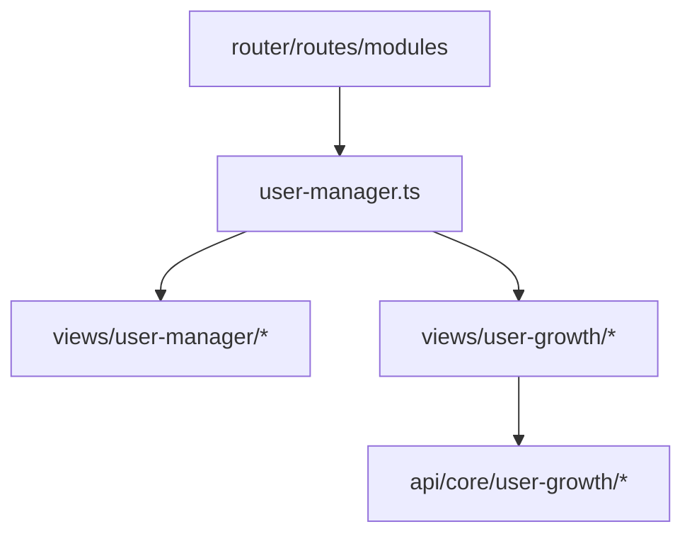
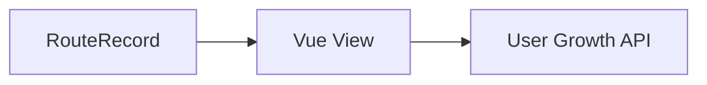

# DESIGN\_用户成长模块改造

## 整体架构图

## 分层设计与核心组件

- 路由层：仅调整子路由配置，保持父级结构不变
- 视图层：补齐缺失视图，用户成长视图统一归档到 `views/user-growth`
- API 层：保持使用 `api/core/user-growth` 与 `api/types/user-growth`

## 模块依赖关系

- `user-manager.ts` 依赖 `views/user-manager/*` 与 `views/user-growth/*`
- 视图模块依赖 `@vben/common-ui` 的 `Page` 组件

## 接口契约

- 路由-视图契约
  - 子路由 `name/path/component/meta.title` 必须一一对应
  - `component` 对应视图文件必须存在
- 视图占位契约
  - 使用 `Page` 作为统一容器
  - 文案与 `meta.title` 一致

## 数据流向

## 异常处理策略

- 若发现 `component` 指向不存在文件，视为阻断项，必须补齐视图
- 若发现重复 `path/name`，必须去重并与 `meta.title` 对齐
