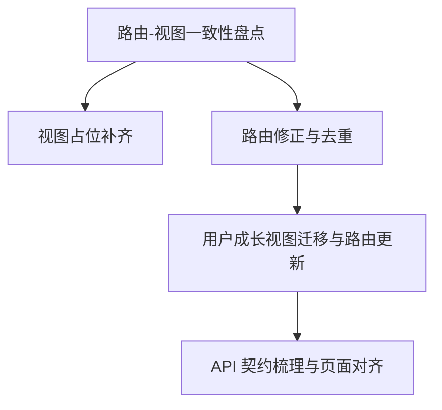

# TASK\_用户成长模块改造

## 子任务拆分

### 任务 1：路由-视图一致性盘点

- 输入契约
  - 路由配置目录：`apps/web-ele/src/router/routes/modules/`
  - 视图目录：`apps/web-ele/src/views/`
- 输出契约
  - 视图缺失清单（以路由组件 import 目标为准）
  - 重复 name/path 清单
- 实现约束
  - 不修改路由层级
  - 不新增与需求无关的视图文件
- 依赖关系
  - 后置：任务 2、任务 3

### 任务 2：视图占位补齐

- 输入契约
  - 任务 1 清单
- 输出契约
  - 对应的 `index.vue` 占位视图文件
- 实现约束
  - 使用最简 `Page` 容器
  - 文案与 `meta.title` 一致
- 依赖关系
  - 依赖任务 1

### 任务 3：路由修正与去重

- 输入契约
  - 任务 1 的重复 name/path 清单
- 输出契约
  - 更新后的子路由配置（唯一 name/path）
- 实现约束
  - 仅修改 `routes/modules` 内子路由
  - 不修改父级层级
- 依赖关系
  - 依赖任务 1

### 任务 4：用户成长视图迁移与路由指向更新

- 输入契约
  - 用户成长视图列表
- 输出契约
  - 视图迁移至 `views/user-growth`
  - 路由 `component` 指向新位置
- 实现约束
  - 不使用 TS/Vite 路径别名
- 依赖关系
  - 依赖任务 3

### 任务 5：API 契约梳理与页面对齐

- 输入契约
  - `api/core/user-growth/*` 请求定义
  - `api/types/user-growth/*` 类型定义
- 输出契约
  - 接口现状清单（端点/入参/出参/字段含义）
  - 页面-接口差异清单
- 实现约束
  - 以 `api/types` 作为当前接口文档基线
  - 不引入未在类型中声明的字段
- 依赖关系
  - 可与任务 4 并行，但需在页面字段调整前完成

## 任务依赖图

