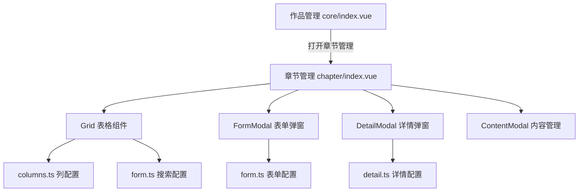

# 章节视图调整 - 架构设计

## 整体架构图



## 分层设计

### 1. 视图层 (index.vue)
- 作为模态框组件嵌入作品管理
- 管理表格、表单、详情、内容管理的弹窗状态
- 处理用户交互逻辑（增删改查、状态切换）

### 2. 配置层 (model/)
- **columns.ts**: 表格列配置，从表单配置转换
- **form.ts**: 表单和搜索配置，定义字段和验证规则
- **detail.ts**: 详情卡片配置，定义分组和字段展示

### 3. 数据层 (API)
- 使用现有的 `chapterXXXApi` 接口
- 类型定义来自 `chapter.d.ts`

## 模块依赖关系

```
chapter/index.vue
├── chapter/model/columns.ts
│   └── chapter/model/form.ts (依赖)
├── chapter/model/form.ts
└── chapter/model/detail.ts

core/index.vue (参考)
├── core/model/columns.ts
│   └── core/model/shared.ts (依赖)
├── core/model/shared.ts
└── core/model/detail.ts
```

## 接口契约

### 输入数据
```typescript
type ShareData = { 
  workId: number;    // 作品ID，必须
  workName: string;  // 作品名称，用于弹窗标题
};
```

### 输出数据
- 通过 `gridApi.reload()` 刷新列表
- 通过 `formApi.close()` 关闭表单
- 通过 `useMessage.success()` 显示操作结果

## 数据流向图

```
┌─────────────────────────────────────────────────────────────┐
│  作品管理视图                                                │
│  ┌─────────────┐                                            │
│  │ 点击章节按钮 │───openChapterModal(workId, workName)───────┼──┐
│  └─────────────┘                                            │  │
└─────────────────────────────────────────────────────────────┘  │
                                                                 │
┌─────────────────────────────────────────────────────────────┐  │
│  章节管理视图 (Modal)                                         │  │
│  ┌─────────────────────────────────────────────────────────┐│  │
│  │ 接收 shareData = { workId, workName }                    ││  │
│  │                                                         ││  │
│  │ Grid 表格                                               ││  │
│  │ ├── 查询: chapterPageApi({ workId, ... })               ││  │
│  │ ├── 展示: ChapterPageResponse list                      ││  │
│  │ └── 操作: 编辑/删除/内容管理                             ││  │
│  │                                                         ││  │
│  │ FormModal 表单                                          ││  │
│  │ ├── 创建: chapterCreateApi(CreateWorkChapterDto)        ││  │
│  │ └── 更新: chapterUpdateApi(UpdateWorkChapterDto)        ││  │
│  │                                                         ││  │
│  │ DetailModal 详情                                        ││  │
│  │ └── 查询: chapterDetailApi({ id })                      ││  │
│  │                                                         ││  │
│  │ ContentModal 内容管理                                   ││  │
│  │ └── 管理章节图片内容                                     ││  │
│  └─────────────────────────────────────────────────────────┘│  │
└─────────────────────────────────────────────────────────────┘  │
                                                                 │
                              refresh grid ◄─────────────────────┘
```

## 异常处理策略

1. **API 错误**: 通过 axios 拦截器统一处理，显示错误消息
2. **表单验证**: 使用表单配置的 `rules` 进行前端验证
3. **状态切换**: 添加 `loading` 状态防止重复操作
4. **数据加载**: 使用 `try-catch` 捕获异常，确保 loading 状态正确重置
