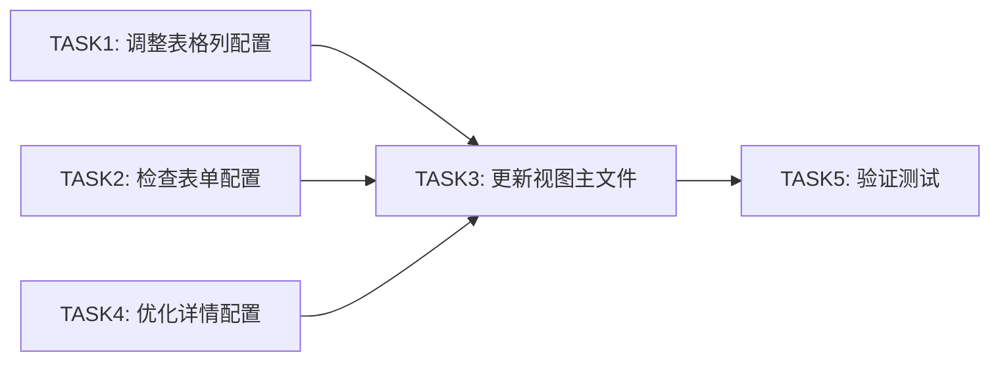

# 章节视图调整 - 原子任务

## 任务依赖图

## 任务1: 调整表格列配置

### 输入契约
- **前置依赖**: 无
- **输入数据**: `chapter/model/form.ts` 中的表单配置
- **环境依赖**: TypeScript, Vxe Table

### 输出契约
- **输出数据**: 更新后的 `chapter/model/columns.ts`
- **交付物**: 表格列配置文件
- **验收标准**:
  - [ ] 列顺序合理（序号、标题、查看规则、状态、时间、操作）
  - [ ] viewRule 列使用 CellTag 渲染，显示中文标签
  - [ ] isPreview 列正确显示
  - [ ] 列宽度设置合理

### 实现约束
- 使用 `formSchemaTransform.toTableColumns` 转换
- 参考 `core/model/columns.ts` 的实现模式

---

## 任务2: 检查表单配置

### 输入契约
- **前置依赖**: 无
- **输入数据**: `chapter.d.ts` 接口类型定义
- **环境依赖**: TypeScript

### 输出契约
- **输出数据**: 确认 `chapter/model/form.ts` 与接口一致
- **交付物**: 表单配置文件（如有调整）
- **验收标准**:
  - [ ] 所有字段与 CreateWorkChapterDto 一致
  - [ ] viewRule 默认值为 -1
  - [ ] 依赖关系配置正确

### 实现约束
- 不修改字段名，只检查一致性
- 默认值与接口要求一致

---

## 任务3: 优化详情配置

### 输入契约
- **前置依赖**: 无
- **输入数据**: 接口返回数据结构
- **环境依赖**: TypeScript

### 输出契约
- **输出数据**: 更新后的 `chapter/model/detail.ts`
- **交付物**: 详情卡片配置文件
- **验收标准**:
  - [ ] 分组结构清晰
  - [ ] viewRule 显示中文映射
  - [ ] 字段与接口一致

### 实现约束
- 保持现有的分组结构
- 参考 `core/model/detail.ts` 的组织方式

---

## 任务4: 更新视图主文件

### 输入契约
- **前置依赖**: TASK1, TASK2, TASK3 完成
- **输入数据**: 更新后的配置文件
- **环境依赖**: Vue 3, TypeScript

### 输出契约
- **输出数据**: 更新后的 `chapter/index.vue`
- **交付物**: 视图主文件
- **验收标准**:
  - [ ] 代码风格与作品管理一致
  - [ ] 类型导入正确
  - [ ] 函数命名规范

### 实现约束
- 保持现有功能不变
- 仅优化代码风格和结构

---

## 任务5: 验证测试

### 输入契约
- **前置依赖**: TASK4 完成
- **输入数据**: 完整的功能代码
- **环境依赖**: 开发环境

### 输出契约
- **输出数据**: `ACCEPTANCE_章节视图调整.md` 验收记录
- **交付物**: 验收文档
- **验收标准**:
  - [ ] 所有功能正常
  - [ ] 无 TypeScript 错误
  - [ ] 界面显示正确

### 实现约束
- 逐项验证验收标准
- 记录测试结果
